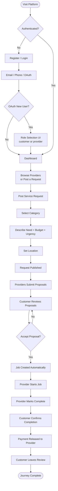
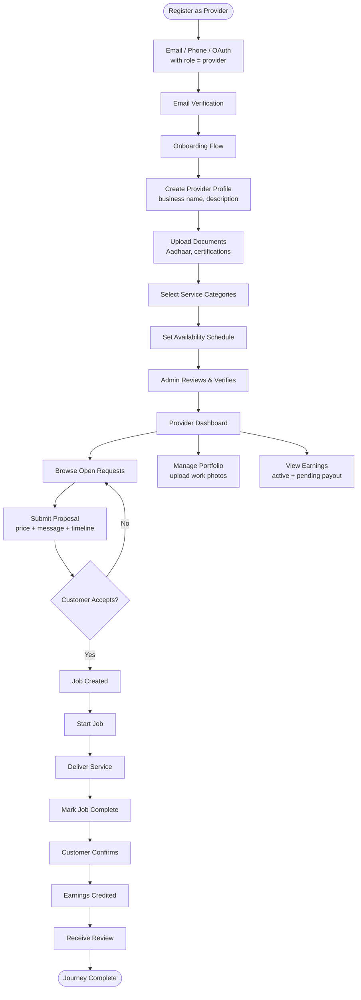
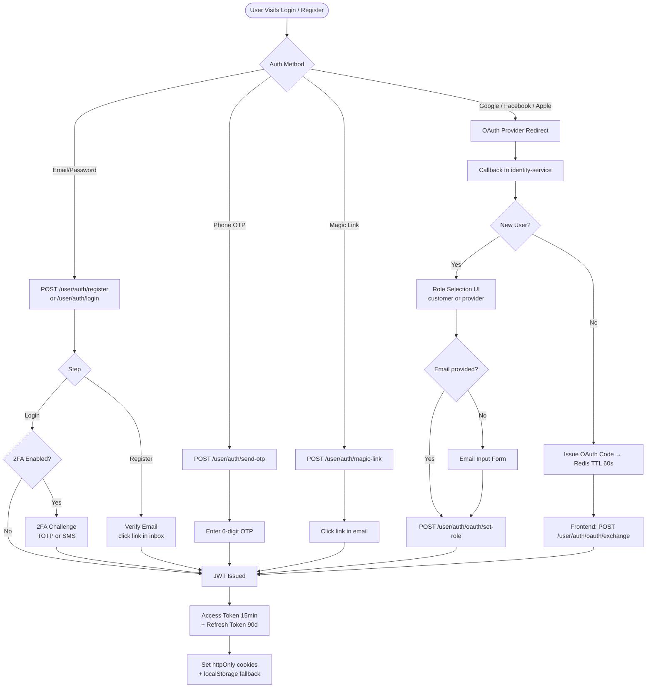
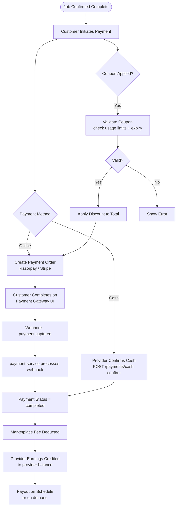
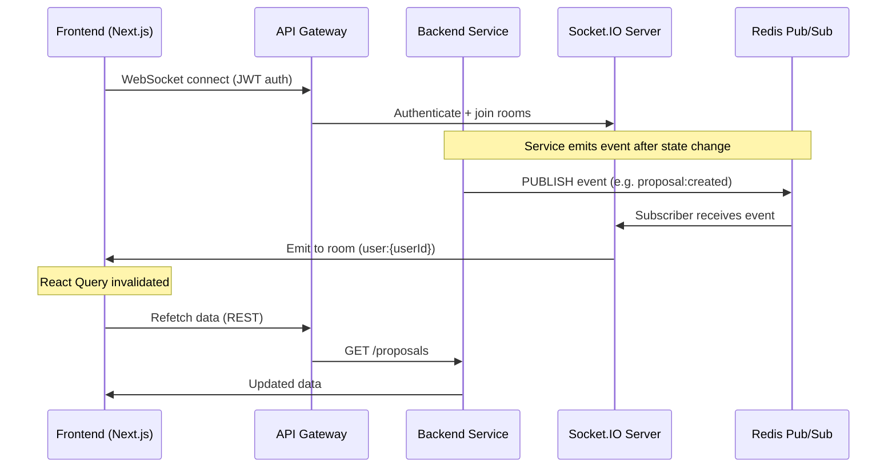
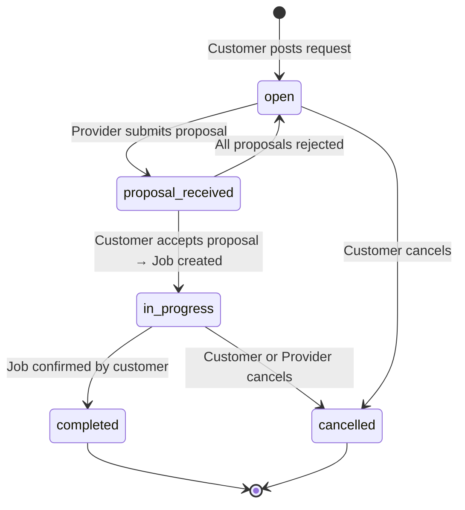
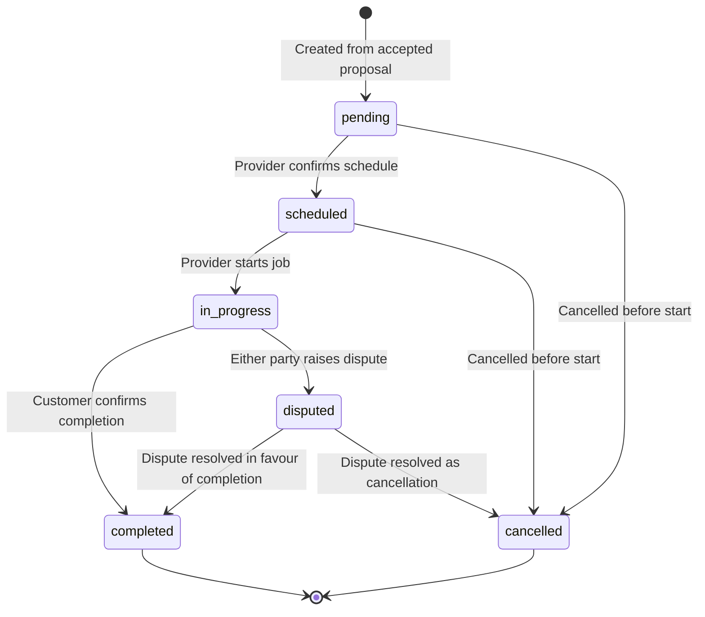
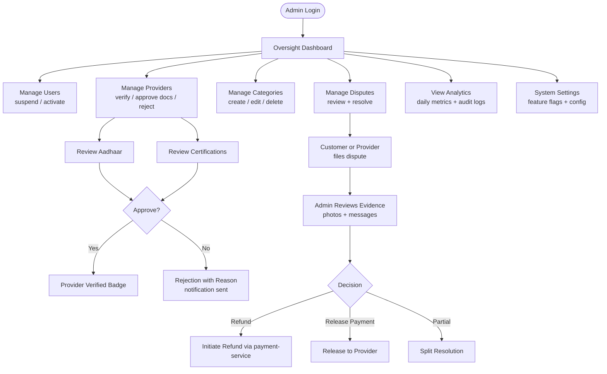
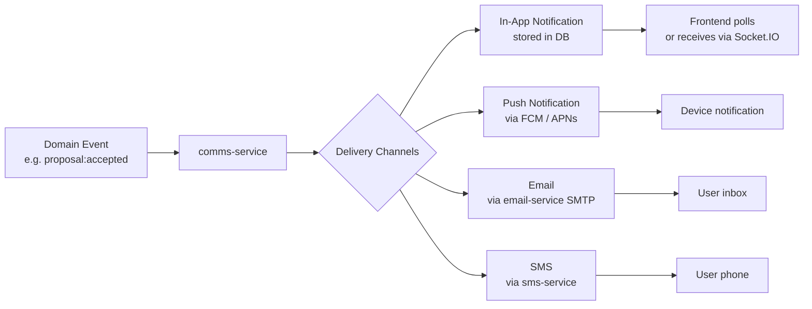
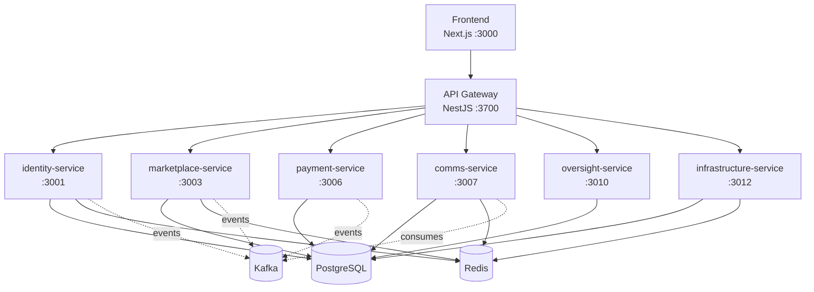

# Application Flow Diagram

This document describes the end-to-end flows of the Local Service Marketplace platform using Mermaid diagrams.

---

## 1. Customer Journey

---

## 2. Provider Journey

---

## 3. Authentication Flows

---

## 4. Payment Flow

---

## 5. Real-Time (Socket.IO) Event Flow

---

## 6. Request Lifecycle State Machine

---

## 7. Job Lifecycle State Machine

---

## 8. Admin & Oversight Flow

---

## 9. Notification Flow

---

## 10. Service Architecture Overview

